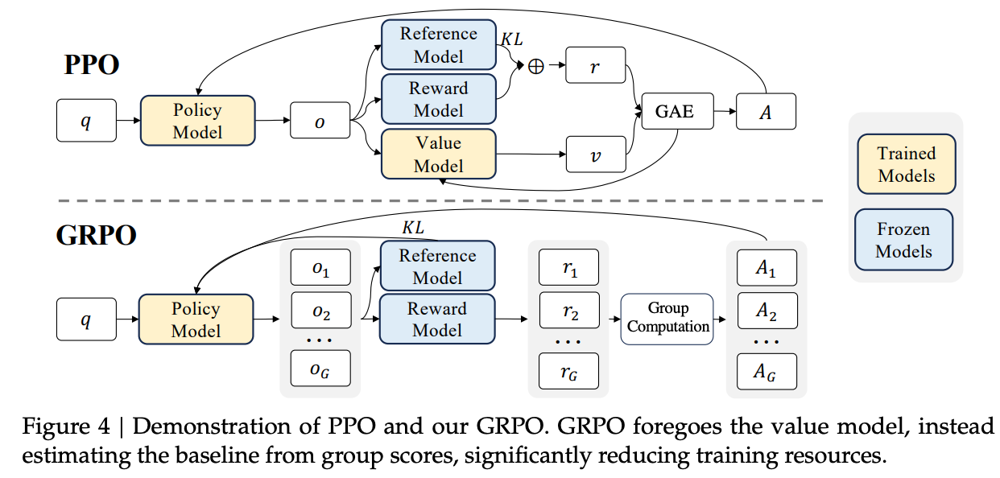

# Reinforcement Learning (RLs) in LLMs

> 本章节记录与 **大语言模型 (LLMs)** 相关的强化学习方法，不仅包含常见的 **PPO** 等标准强化学习算法，还涵盖一些 **类强化学习 (RL-like)** 的方法，例如 **Direct Preference Optimization (DPO)**、**Rejection Sampling Fine-Tuning (RFT)**等。这些方法虽然未必严格遵循传统的 RL 框架，但在实践中承担了类似的“基于偏好/反馈优化模型”的角色，因此一并整理在此。

## 0. Fundamentals of RL

### Q. 强化学习中 Reward Model 和 Critic Model 的区别？
> **Company**: 蔚来 ｜ **Round**: 算法工程师 一面 ｜ **Date**: 2025-09-04 ｜ **Tags**: [RL, Reward Model, Critic Model]

**1. Reward Model（奖励模型）**  
- **作用**：用于定义任务目标，给出每个状态或动作的“好坏”评分。  
- **来源**：  
  - 在传统 RL 中通常是**环境给定的规则函数**（如得分、胜负结果）。  
  - 在人类反馈强化学习（RLHF）中，Reward Model 往往是一个**额外训练的模型**，通过人类偏好或标注数据拟合而来。  
- **特点**：  
  - 更偏向任务目标本身的定义。  
  - 输出标量奖励值，用于指导训练方向。  
- **例子**：围棋中“输赢”结果，推荐系统中“用户是否点击/喜欢”，RLHF 中“用户是否偏好某个回答”。  

**2. Critic Model（评论者模型/价值函数模型）**  
- **作用**：评估策略的质量，估计某个状态（或状态-动作对）的长期回报期望。  
- **来源**：由 RL 算法（如 Actor-Critic、DDPG、PPO 等）在训练过程中学习得到。  
- **特点**：  
  - Critic 不直接定义任务目标，而是近似计算 **“从这里开始，未来能得到多少奖励”**。  
  - 输出的是 **状态价值 V(s)** 或 **动作价值 Q(s,a)**。  
- **例子**：在游戏中，Critic 会评估“当前局面如果继续按照策略玩下去，未来预期得分是多少”。  

**3. 二者的关键区别**  
| 方面          | Reward Model                           | Critic Model                          |
|---------------|----------------------------------------|---------------------------------------|
| 定义来源      | 来自环境规则或人类反馈（外部信号）       | 来自算法内部训练（对奖励的估计）        |
| 作用目标      | 定义任务目标/偏好                       | 评估策略的长期表现                     |
| 输出          | 即时奖励（标量）                       | 价值函数 V(s) 或 Q(s,a)               |
| 在 RLHF 中    | 通过人类偏好训练，用于替代环境奖励       | 结合策略更新，帮助 Actor 学习          |

**4. 总结**  
- **Reward Model** 是任务目标的外部定义（“我要什么”）。  
- **Critic Model** 是对策略的内部评估（“这样做能得到多少”）。  
- 在实际 RL 系统中，Reward Model 给出奖励信号，而 Critic Model 学习对未来奖励的近似，二者配合引导 Agent 学习最优策略。

<mark>Reward Model 定义任务目标（外部信号），Critic Model 评估策略质量（内部估计）。Reward Model 给出即时奖励，Critic 估计未来回报，两者协同引导策略优化。</mark>

### Q. Reward 需要可微吗？
> **Company**: 蔚来 ｜ **Round**: 大模型算法工程师 一面 ｜ **Date**: 2025-09-04 ｜ **Tags**: [RL, Reward Model, 可微]

**1. 传统强化学习中的 Reward**  
- 在标准 RL 框架（Q-learning、Policy Gradient 等）中，Reward **不需要可微**。  
- 原因：  
  - 策略更新依赖的是 **采样的奖励信号**（scalar），而不是 Reward 函数的梯度。  
  - 算法通过 **策略梯度定理** 或 **值函数估计** 间接优化预期回报。  
- 举例：围棋的“胜/负”奖励是离散的，不可微，但依然能驱动 AlphaGo 学习。  

**2. 基于 Reward Model 的场景（RLHF 等）**  
- 在 RLHF 中，Reward Model 是一个可训练的神经网络，输入文本/动作，输出奖励分数。  
- Reward Model 本身是可微的，但在 **RL 训练阶段**，它通常作为 **黑箱函数** 提供打分，并不直接反向传播到策略网络。  
- 策略网络仍通过 **policy gradient（REINFORCE, PPO, GRPO 等）** 来更新，而不是对 Reward Model 做链式梯度。  

**3. 为什么很多人会问“是否可微”**  
- 如果 Reward 是 **手工定义函数**（如奖励=准确率），通常不可微，但 RL 照样能用。  
- 如果 Reward 来自 **模型打分（Reward Model）**，它是可微的，但 RL 算法大多数情况下不需要对 Reward 做反向传播。  
- 只有在少数**可微分强化学习**（Differentiable RL）或**基于能量函数的方法**里，Reward 的可微性才会被显式利用。  

**4. 总结**  
- **常规模型/环境奖励**：不需要可微，RL 照常训练。  
- **Reward Model (RLHF)**：内部可微，但训练策略时只作为打分器，不做端到端梯度传播。  
- **特例场景**：在一些端到端可微优化框架下（如可微控制、能量模型优化），Reward 可微才有额外优势。  

<mark>**结论**：在大多数 RL 和 RLHF 应用中，Reward 不需要可微；它只需要提供稳定、合理的数值信号。</mark>

### Q. Reward Model 怎么训练的？
> **Company**: 蔚来 ｜ **Round**: 大模型算法工程师 一面 ｜ **Date**: 2025-04-08 ｜ **Tags**: [RL, Reward Model, 训练]

**1. 训练目标**  
Reward Model 的作用是**将人类偏好转化为可学习的奖励信号**，为后续的 RLHF 提供监督。  
- 输入：模型生成的多个候选输出（通常是同一个 prompt 的不同回答）。  
- 标签：人工标注的偏好排序（哪一个回答更好）。  
- 输出：Reward Model 给每个回答打分（标量）。  

**2. 数据构建**  
- **收集人类偏好数据**：对同一输入 prompt 的多个模型回答，人工进行排序或 pairwise 比较。  
- **形式**：  
  - **Pairwise**（二选一）：标注 A 比 B 好。  
  - **Ranking**（排序）：对多个回答从好到坏排序。  
- 这种偏好数据比逐字 token 标签更容易获得，且更符合人类直观判断。  

**3. 训练方法**  
- 典型做法是 **Pairwise Ranking Loss (基于 Bradley-Terry / Logistic 回归)**：  
  - Reward Model 输出每个回答的分数 $r_\theta(x)$。  
  - 若人类认为回答 A 优于 B，则最小化：  
    $$
    \mathcal{L} = -\log \sigma(r_\theta(A) - r_\theta(B))
    $$
  - 其中 $\sigma$ 是 sigmoid 函数。  
- 换句话说：训练目标是让 Reward Model 打分与人类偏好一致。  

**4. 训练流程**  
1. 用一个预训练模型（如 GPT）生成多样化回答。  
2. 人类对回答做偏好标注（pairwise/ranking）。  
3. 用标注数据训练 Reward Model，让它学会给出与人类一致的评分。  
4. 将 Reward Model 固定，作为 RL 阶段的“环境奖励函数”。  

**5. 关键点**  
- **数据质量**：Reward Model 的效果依赖标注一致性和覆盖面。  
- **模型结构**：通常与原始语言模型结构相同，仅在输出层添加一个 reward head。  
- **过拟合风险**：需要正则化/Dropout，避免 Reward Model 记住训练集。  
- **稳定性**：Reward Model 不需要极高精度，但必须能反映人类偏好的总体趋势。  

**6. 总结**  
- Reward Model 通过 **人类偏好标注数据 + Pairwise Ranking Loss** 进行训练。  
- 它本质上是一个“打分器”，学习把回答映射到人类满意度分数，为后续的 PPO 等 RL 算法提供奖励信号。

<mark>Reward Model 通过人类偏好数据训练，使用 pairwise ranking loss，让模型学会给回答打分，反映人类偏好，为 RLHF 提供奖励信号。</mark>

## 1. [RLHF](https://arxiv.org/abs/2204.05862) (Reinforcement Learning from Human Feedback)

### Q. RLHF的完整流程有哪些？
> **Company**: 美团 | **Round**: 本地商业大模型一面 | **Date**: 2025-08-28 | **Tags**: [RL, RLHF]

1. **Step 0（可选）：SFT 作为起点**
- **做什么**：用指令数据对基座模型做一次 **监督微调（SFT）**。
- **怎么做**：`(prompt, response*)` 的有监督交叉熵训练，得到 **参考策略** π_ref（也可直接拷贝 SFT 权重作为 π_ref）。
- **为什么**：把模型先对齐到“能按指令作答”的分布，降低后续 RL 的探索难度与不稳定性。
2. Step 1：从当前策略采样多候选响应（数据收集）
- **做什么**：对每个 prompt \(x\) 从策略 π_θ 采样 K 个响应 \(y_{1..K}\)。
- **怎么做**：
  - 采样策略：温度/Top-p/Top-k，限制最大长度与停用词；去重（哈希/近似去重）。
  - 过滤：简单安全/质量规则（脏词、模板化、空答），保留可分辨质量的候选。
  - 记录元信息：log-prob、长度、采样参数，以便后续分析 length bias 和 KL。
- **为什么**：必须有“好坏对比”的候选，后续才能产生偏好信号。

> **常见坑**：全部“很差”或“很像”的候选会削弱后续信号。

3. **Step 2：人类偏好标注/排序（偏好蒸馏）**
- **做什么**：对同一 prompt 下的候选按质量 **成对比较或排序**：$(y^+ \succ y^-)$ 或 $(y_{(1)} \succ y_{(2)} \succ \dots)$。
- **怎么做**：
  - **Pairwise** 是主流：更稳、更一致；也可用 **k-wise 排序**（Plackett–Luce）。
  - 制定**评分准则**（有用/无害/真实/风格），做标注前校准标注者；允许“并列/无法比较”以减少噪声。
  - 可用 **AI-feedback（RLAIF）** 或 规则库辅助，降低人工成本（注意引入系统性偏差）。
- **为什么**：把人类偏好转为可学习信号，是后续训练奖励模型（RM）的依据。

> **常见坑**：标签噪声、长度偏好、领域偏置；需抽样复核与一致性检查（如 κ 系数）。

4. **Step 3：训练奖励模型（Reward Model, RM）**
- **做什么**：学一个打分函数 $(r_\phi(x, y) \in \mathbb{R})$，拟合“哪个回答更好”的偏好。
- **怎么做**（以 pairwise 为例）：
  - **Bradley–Terry 损失**  
    $$
    \mathcal{L}_{\text{RM}} = - \mathbb{E}_{(x, y^+, y^-)}
    \big[\log \sigma\big(r_\phi(x, y^+) - r_\phi(x, y^-)\big)\big]
    $$
  - 模型结构：复用基座 Transformer，取 **EOS 向量/mean-pool** 过一个线性头输出标量。
  - 正则化：长度惩罚/奖励归一化，dropout，权重衰减；监控 **pairwise-acc/AUC**。
- **为什么**：RM 提供可微分的“人类偏好代理”，供 RL 优化目标使用。

> **常见坑**：RM **过拟合**导致“奖励黑客”（policy 专门投机 RM 的缺陷）；需做独立验证与漂移监控。

5. **Step 4：基于 RM 的策略优化（PPO 等）**
- **做什么**：用 RL 优化策略 π_θ，使其在 RM 下得分更高，同时**约束**不偏离 π_ref。
- **怎么做**：
  - 目标函数（KL-正则化）：
    $$
    \max_{\theta}\ \mathbb{E}_{x,y\sim \pi_\theta}
    \big[r_\phi(x,y)\big]\ -\ \beta\, \mathrm{KL}\!\left(\pi_\theta(\cdot|x)\ \Vert\ \pi_{\text{ref}}(\cdot|x)\right)
    $$
  - **奖励塑形**（token-level）：把序列奖励分摊到 token，并将 KL 惩罚写成逐 token 的“惩罚项”，结合 **GAE** 计算 advantage。
  - **PPO 细节**：剪切比值 $\$( \text{clip}(\cdot, 1\pm\epsilon))$、多 epoch 小批量更新、value/entropy 系数调参；on-policy 采样与 **新鲜轨迹**。
  - **迭代**：收集 → 更新 → 评估；必要时回到 Step 1/2 扩充数据，或重训 RM。
- **为什么**：在“对齐人类偏好”的同时保持语言分布稳定（KL 约束防止退化或风格飘移）。

> **常见坑**：
>- **KL 系数 β 失衡**：β 太小→发散/风格塌陷；太大→进步有限。  
>- **探索不足/过早收敛**：采样温度、长度上限、奖励归一化需要联动调。  
>- **训练不稳定**：on-policy 噪声大；可用 **replay mixing/渐进 β** 缓解。

<mark>**Note**: 1) 采样多候选 → 2) 偏好标注 → 3) 训练 RM（pairwise BT 损失） →  4) RL（PPO：最大化 RM 奖励 + KL 约束对 π_ref 的偏移） →  5) 评测/回流/再训练（必要时重训 RM & 扩充偏好数据）。</mark>

### Q. LLMs 训练中 PPO 中 action 是什么，整个输出叫什么？
> **Company**: 蔚来 ｜ **Round**: 大模型算法工程师 一面 ｜ **Date**: 2025-09-04 ｜ **Tags**: [RL, PPO, Action]

**1. PPO 背景**  
- PPO（Proximal Policy Optimization）是一种常用的策略梯度方法，用来在 RLHF（Reinforcement Learning with Human Feedback）中优化 LLM 的生成策略。  
- 训练过程中，LLM 被看作一个 **policy network**，根据输入上下文输出一个 token 分布。  

**2. PPO 中的 Action**  
- 在 RL 框架中，**action** 表示 agent 在某个状态下采取的具体动作。  
- 在 LLM 中，**一个 action 就是选择生成的下一个 token**（例如在词表里的某个词）。  
- 也就是说，LLM 的策略是一个概率分布 $P_\theta(a_t \mid s_t)$，从中采样出一个 token 作为 action。  

**3. 整个输出叫什么**  
- LLM 在一个 prompt 下逐步生成多个 token，形成完整的文本序列。  
- 从 RL 的角度看：  
  - 单个 token = **action**  
  - 整个生成的 token 序列 = **trajectory（轨迹）** 或 **episode（回合）**  
- 在 RLHF/PPO 文献中，一般称整个输出序列为 **trajectory**，因为它对应一次完整的状态-动作序列，最终得到一个 reward（来自 Reward Model）。  

**4. 总结**  
- **Action**：单个生成的 token。  
- **整个输出**：完整的生成序列，通常称为 **trajectory**（轨迹）。  

<mark>面试答法：在 PPO 中，action 是 LLM 生成的单个 token，而整个输出文本序列在 RL 术语里叫 trajectory，表示完整的一次生成过程。</mark>

### Q. PPO的更新函数，GAE分别是什么？
> **Company**: None | **Round**: None | **Date**: None | **Tags**: [RL, PPO, GAE, KL]

**1. PPO 的优化函数**
PPO（Proximal Policy Optimization）的核心目标是：在提升策略性能的同时避免过大更新。  
其 **clip surrogate objective** 为：
$$
L^{\text{clip}}(\theta) =
\mathbb{E}_t \left[
\min \Bigg(
r_t(\theta) A_t,\;
\operatorname{clip}\big(r_t(\theta), 1-\epsilon, 1+\epsilon \big) A_t
\Bigg)
\right]
$$

其中：
- $r_t(\theta) = \frac{\pi_\theta(a_t|s_t)}{\pi_{\theta_{\text{old}}}(a_t|s_t)}$ 为概率比值；
- $A_t$ 为优势函数（advantage）；
- $\epsilon$ 是超参数（如 0.1–0.2），限制更新幅度。

**直观理解**：更新策略时，若概率比偏离太多，就裁剪掉，保证更新“不过猛”，提高训练稳定性。

**完整的 PPO 目标函数**（含扩展项）：  
$$L^{\text{PPO}}(\theta, \gamma) =L^{\text{clip}}(\theta) \;+ w_1 H(\theta) \;- w_2 KL(\theta) \;- w_3 L_V(\gamma)
$$

其中：
- $H(\theta) = -\mathbb{E}_{a_t \sim \pi_\theta}[\log \pi_\theta(a_t|s_t)]$  
  → **熵奖励**:
  - **鼓励探索**：提升策略的多样性，避免模型过早收敛到少数动作。
  - **防止塌陷**：如果没有熵奖励，策略可能变得过于确定（低熵），导致梯度信号变弱甚至训练停滞。  
  - **提升泛化**：在 RLHF 场景下，有助于生成更丰富的语言表达，而不仅仅重复高奖励模式。  
- $KL(\theta) = D_{\text{KL}}(\pi_\theta(\cdot|s_t) \| \pi_{\text{ref}}(\cdot|s_t))$  
  → **KL 约束**，惩罚策略偏离参考分布过远；  
- $L_V(\gamma) = \big(V_\theta(s_t) - \hat{R}_t\big)^2$  
  → **价值函数损失**，保证 Critic 预测的状态价值接近真实回报；  
- $w_1, w_2, w_3$：对应各个正则项的权重。  

**总结**  
PPO 的目标由四部分构成：  
1. **Clip 损失**：核心，保证策略更新稳定；  
2. **熵奖励**：提升探索性，避免策略过早收敛；  
3. **KL 惩罚**：限制与参考策略的分布差距，防止 reward hacking；  
4. **价值函数损失**：保证 Critic 准确，支撑优势估计。  

<mark>**Note**：在 LLM 的 RLHF 中，熵奖励常用于初期训练，保证模型输出的多样性；但在一些变体（如 GRPO）中，**不显式使用熵奖励**，因为“组内采样”已经带来一定的探索性。  <mark>

**2. 在 RL 奖励估计中的例子**

- **蒙特卡洛方法 (MC)**  
  - 每次 advantage 用“完整未来回报”计算。  
  - → **偏差低**（因为考虑所有真实回报），但每次采样不同，波动很大，**方差高**。  
  - 类比：每次都能看全卷子成绩（准确），但样本之间差异很大。  

- **一步 TD 方法**  
  - 只看一步奖励 + 价值函数估计。  
  - → **方差低**（因为波动少），但长期奖励被截断，**偏差高**。  
  - 类比：只看平时作业成绩（稳定），但和最终总成绩可能差很多。  

- **GAE (λ=0.95)**  
  - 在 MC（低偏差高方差）和 TD（高偏差低方差）之间加权平均。  
  - → 在一定程度上同时降低方差、减少偏差。  
  - 类比：既参考期末考试，又看作业，得到更稳更准的分数预估。  

**3. GAE（Generalized Advantage Estimation）**  
GAE 是一种计算优势函数 $A_t$ 的方法，核心目的是 **在偏差和方差之间折中**。  

公式：
$$
\hat{A}_t^{\text{GAE}(\gamma, \lambda)} =
\sum_{l=0}^\infty (\gamma \lambda)^l \,\delta_{t+l}
$$

其中：
- $\delta_t = r_t + \gamma V(s_{t+1}) - V(s_t)$：TD 误差。  
- $\gamma$：折扣因子，控制“未来奖励的重要性”。  
- $\lambda$：平衡参数，控制偏差/方差。  

👉 **直观理解**：  
- 如果 $\lambda=1$：接近蒙特卡洛估计MC（考虑完整未来回报），**无偏差但方差大**；  
- 如果 $\lambda=0$：退化为一步 TD 估计，**方差小但偏差大**；  
- 取中间值（如 0.95）：能同时减少方差、保持较小偏差，使 advantage 更稳定。  

<mark>GAE 就是：**把未来回报“加权平均”到当前状态，平滑 advantage 信号，减少训练抖动**。</mark>

### Q. 解释一下在PPO Loss函数中的KL散度以及他的公式
> **Company**: None | **Round**: None | **Date**: None | **Tags**: [RL, KL]

在 RLHF 中，常在 PPO 目标上加 KL 惩罚，防止策略偏离参考模型（如 SFT 模型）太远。 

**公式：**
$$
L_{\text{KL}}(\theta) = - \beta \,
D_{\text{KL}}\!\big(\pi_\theta(\cdot|x) \;\|\; \pi_{\text{ref}}(\cdot|x)\big)
$$

- **离散情形**
  $$
  D_{\mathrm{KL}}(P\|Q)
  = \sum_{x} P(x)\,\log\frac{P(x)}{Q(x)}.
  $$

- **连续情形**
  $$
  D_{\mathrm{KL}}(P\|Q)
  = \int P(x)\,\log\frac{P(x)}{Q(x)}\,\mathrm{d}x.
  $$

**作用：**
- 保证模型在对齐人类偏好时不丧失原有语言能力；  
- 避免“奖励黑客”，即模型投机性利用奖励模型漏洞；  
- 控制更新步长，使模型保持稳定、可控。  

<mark>**Note**：KL 散度衡量两个分布的差异，PPO 中的 KL 惩罚通过限制策略分布别跑太远，保证在对齐的同时维持语言流畅性与安全性。 <mark>

### Q. 为什么在 SFT之后还需要进行 RLHF？
> **Company**: 阿里 ｜ **Round**: 算法工程师 一面 ｜ **Date**: 2025-08-01  **Tags**: [RL, RLHF, SFT]

- **SFT 学“正确”，但缺“偏好导向”**
  SFT 使用标注的 prompt–response 对训练，让模型学会“看懂指令、生成合理回答”，但缺乏对“人类真正想要的回答”的对齐能力。

- **RLHF 引入“人类偏好”作为优化目标**
  RLHF 通过训练一个奖励模型（Reward Model）来模拟人类对回答的喜好，然后使用强化学习（如 PPO）驱动模型优化，使生成的回答更符合人类的价值判断、礼貌性和实用性。

- **减少“暴露偏差”和提升“泛化能力”**
  SFT 模型只能模仿训练示例，难以适应新场景；RLHF 通过交互生成与奖励反馈的训练循环，有助于模型暴露在不同生成样本上，从而提升其对未见输入的泛化能力。

- **权衡“多样性 vs 对齐”**
  RLHF 更能引导模型输出符合人类期望的内容，但可能牺牲一定的创造性或多样性。SFT 则输出更丰富但不一定安全或符合人类偏好。

<mark>SFT 帮模型掌握基本指令应答能力；而 RLHF 则进一步让响应“更加符合人类偏好、安全可靠”，提升实际使用体验和模型对齐质量。</mark>

### Q. PPO 训练的时候，显存里有几个模型？训练的时候哪些模型要更新，哪些不更新？
> **Company**: 阿里智能信息 ｜ **Round**: 大模型算法工程师 暑期实习一面 ｜ **Date**: 2025-08-18  **Tags**: [RL, PPO, 模型更新]

- **显存中通常会有 4 个模型**：  
  1. **Actor（Policy Model）**：策略模型，用于生成动作/回复。  
  2. **Critic（Value Model）**：价值函数，用于估计状态价值，支撑优势函数 (Advantage) 计算。  
  3. **Reference Model**：固定的对照模型，用于计算 KL 散度惩罚，保证策略不会偏离初始分布太多。  
  4. **Reward Model (RM)**：有时也会加载 RM 来评估奖励，但通常不在显存中更新。

- **训练时哪些更新**：  
  - **Actor**：✅ 会更新（目标是最大化奖励信号，同时受 KL penalty 限制）。  
  - **Critic**：✅ 会更新（回归奖励的价值估计，帮助降低方差）。  
  - **Reference Model**：❌ 不更新（固定作为对照基准，保证稳定性）。  
  - **Reward Model**：❌ 通常不更新（如果在显存中，通常是冻结的）。

- **关键点**：  
  - Actor 和 Critic 通常共享部分编码层（例如 Transformer backbone），也可以独立。  
  - Reference Model 是 Actor 初始权重的冻结拷贝。  
  - KL 散度约束来自 **Actor 与 Reference** 的输出分布差异。  

<mark>核心：PPO 训练时显存里一般有 Actor、Critic、Reference、RM 四个模型，只有 Actor 和 Critic 会更新，Reference 和 RM 通常保持不变。</mark>

### Q. 在 PPO 训练中，KL 散度是越大越好还是越小越好？
> **Company**: 阿里智能信息 ｜ **Round**: 大模型算法工程师 暑期实习一面 ｜ **Date**: 2025-08-18  **Tags**: [RL, PPO, KL 散度]

- **KL 散度的含义**：  
  - 衡量 **当前策略 (Actor)** 与 **参考策略 (Reference)** 的差异。  
  - PPO 中通过 KL penalty 或 clipping 来限制更新幅度，避免策略崩溃。  

- **期望目标**：  
  - KL 散度 **不能太大**：  
    - 太大会导致新策略偏离过远，训练不稳定，甚至生成异常输出。  
  - KL 散度 **也不能太小**：  
    - 太小说明策略几乎没更新，学习停滞。  

- **正确理解**：  
  - **目标不是极大化或极小化，而是控制在合理区间**。  
  - 一般会设置 KL 散度目标值（如 $0.01 \sim 0.1$），并在训练中动态调整奖励加权或学习率。  

<mark>核心：PPO 中 KL 散度既不是越大越好，也不是越小越好，而是要控制在“适中”的范围，用来约束策略更新幅度，保证训练既能学习到新行为，又保持稳定。</mark>

### Q. 在 PPO 中 Policy 的更新方向是什么？Critic 又是如何更新的？
> **Company**: 阿里智能信息 ｜ **Round**: 大模型算法工程师 暑期实习一面 ｜ **Date**: 2025-08-18  **Tags**: [RL, PPO, Policy, Critic]

- **Policy（Actor）的更新方向**：  
  - 目标：让当前策略在**优势函数 A(s,a)** 为正的动作上概率增大，A 为负的动作上概率减小。  
  - 优化目标函数：  
    $$
    L^{CLIP}(\theta) = \mathbb{E}_t \Big[ \min\big( r_t(\theta) A_t, \ \text{clip}(r_t(\theta), 1-\epsilon, 1+\epsilon) A_t \big) \Big]
    $$  
    其中 $r_t(\theta)=\frac{\pi_\theta(a_t|s_t)}{\pi_{\theta_{\text{old}}}(a_t|s_t)}$。  
  - 更新方向：  
    - **提升优势为正的动作概率**。  
    - **压低优势为负的动作概率**。  
    - 同时通过 **clip** 或 **KL penalty** 约束更新不要偏离参考策略太远。  

- **Critic（Value Function）的更新**：  
  - **目标**：预测状态价值 $V_\phi(s)$，用于 Advantage 计算，降低方差。  
  - **训练信号**：来自采样轨迹的“目标回报” $R_t$，实际 PPO 多用 **GAE**：  
    $$
    \delta_t = r_t + \gamma V_\phi(s_{t+1}) - V_\phi(s_t), \quad
    \hat{A}_t = \sum_{l=0}^\infty (\gamma \lambda)^l \delta_{t+l}
    $$  
    并定义 $R_t = \hat{A}_t + V_\phi(s_t)$。  
  - **优化目标**：最小化 MSE 损失：  
    $$
    L^{VF}(\phi) = \mathbb{E}_t \Big[ (V_\phi(s_t) - R_t)^2 \Big]
    $$  
  - **更新方式**：迭代更新 Critic 参数 $\phi$，使得 $V_\phi(s)$ 逼近 $R_t$，提供稳定的价值估计。  

- **Actor vs Critic 更新公式对照表**：

| 模型   | 目标函数 | 更新方向 | 监督信号来源 |
|--------|----------|----------|--------------|
| **Actor (Policy)** | $L^{CLIP}(\theta)$ = 约束下最大化优势函数 | 提升优势正的动作概率，降低优势负的动作概率，受 clip/KL 限制 | 来自 Critic 估计的 Advantage |
| **Critic (Value)** | $L^{VF}(\phi)= (V_\phi(s)-R_t)^2$ | 用 MSE 回归状态价值，逼近回报目标 | 来自奖励序列/GAE 计算的 $R_t$ |

<mark>核心：PPO 中 Policy 更新方向 = “优势为正就增大概率，优势为负就减小概率”，通过 clip/KL 保证稳定；Critic 更新 = “用 MSE 回归回报 (常由 GAE 得到)”，为 Actor 提供稳定的 Advantage 估计。</mark>

### PPO是on-policy的吗？如果是，为什么有ratio?
> **Company**: None | **Round**: None | **Date**: None | **Tags**: [RL, PPO, on-policy, ratio]

- **先回答是否 on-policy**  
  - PPO **一般被归类为 on-policy 算法**，因为它要求数据是由“当前策略”采样出来的，不能像 DQN/IMPALA 那样用旧数据反复利用。  
  - 但是，在实现上，PPO 会在一个 batch 内用同一批轨迹数据更新多次参数，这就带来 **策略在更新过程已经改变 → 数据和当前策略不再完全一致**。  
  - 所以严格来说：  
    - **第一个 mini-batch 更新时** → on-policy（采样策略和更新策略一致）。  
    - **后续 mini-batch** → 有点偏离（off-policy 成分），因为采样的行为和更新后的策略已经不完全一致。  
  - 因此 PPO 更精确地说是 **“近似 on-policy” (approximately on-policy)**。

- **为什么需要 ratio？**  
  - 由于训练中会复用旧策略数据，而策略在更新时已经发生偏移，PPO 要用一个 **修正因子 ratio** 来控制更新幅度：  
    $$
    r_t(\theta) = \frac{\pi_\theta(a_t|s_t)}{\pi_{\theta_{\text{old}}}(a_t|s_t)}
    $$  
  - **作用**：  
    1. 保证更新时考虑当前策略与旧策略的差异。  
    2. 通过 **clip 或 KL penalty** 限制 ratio 偏离过大，避免训练崩溃。  
  - **直观理解**：ratio 是 PPO 用来处理“理论上 on-policy，实际上存在 off-policy 成分”的修正手段。  

- **总结**  
  - PPO **被认为是 on-policy**，因为它的核心前提是“采样自当前策略”。  
  - 但在实践中，它不可避免地包含了 **off-policy 成分**（多次复用数据）。  
  - **ratio 的存在正是为了缓解这种偏离**，保证训练稳定。  

<mark>核心：PPO 是“近似 on-policy”，ratio 用来修正策略更新带来的分布偏移，既保证了 on-policy 理论基础，又允许有限度的数据复用。</mark>

## 2. [DPO]() (Direct Preference Optimization)

### Q. PPO 和 DPO 在大模型对齐中的主要区别是什么？
> **Company**: 淘天 ｜ **Round**: Agent智能体 一面 ｜ **Date**: 2025-08-26 ｜ **Tags**: [RL, DPO, PPO]

1. **PPO (Proximal Policy Optimization in RLHF)**  
   - **流程**：  
     1. 从人类偏好数据训练一个奖励模型 (Reward Model)。  
     2. 用奖励模型对生成结果打分。  
     3. 用 PPO 算法更新策略，最大化奖励，同时加 KL 正则，保证不偏离原分布太远。  
   - **优势**：  
     - 灵活性高：不仅能用偏好排序，还能结合稀疏奖励、规则约束、多维 reward（安全性、真实性、多样性）。  
     - 更符合 RL 框架，理论上可以适配更复杂的环境。  
   - **不足**：  
     - 需要单独训练 RM，成本高。  
     - Rollout 和 reward scaling 容易不稳定，调参难度大。  

2. **DPO (Direct Preference Optimization)**  
   - **流程**：  
     - 直接利用人类偏好对 (better vs worse)，构造对比损失函数，约束新策略与参考策略的比值，使更优回答概率更高。  
     - 不需要奖励模型，也不需要 RL 算法。  
   - **优势**：  
     - 训练更简单高效，不需要 RM 和复杂 rollouts。  
     - 收敛稳定，适合大规模对齐任务。  
   - **不足**：  
     - 表达能力有限：只能依赖 pairwise 偏好，不能直接引入复杂 reward 信号。  
     - 灵活性弱于 PPO，不适合涉及多目标优化的场景。  

3. **主要区别总结**  
   | 维度            | PPO (RLHF)                           | DPO                                   |
   |-----------------|--------------------------------------|---------------------------------------|
   | **是否需 RM**   | 需要训练奖励模型                     | 不需要奖励模型                        |
   | **优化方式**    | 强化学习，基于 reward + KL 正则       | 对比学习，基于偏好 pair               |
   | **灵活性**      | 可扩展到多维奖励 / 稀疏奖励场景       | 更局限，只能处理 pairwise 偏好        |
   | **训练成本**    | 高：RM + RL + 调参                   | 低：直接监督式优化                    |
   | **收敛稳定性**  | 可能不稳定，需小心调节               | 通常更稳定、简单                      |

<mark>PPO 灵活、通用，能融合多种 reward，但训练复杂；DPO 简洁高效，适合大规模对齐，但表达能力和灵活性不如 PPO。</mark>

### Q. DPO 训练通常有哪些注意事项？
> **Company**: 淘天 ｜ **Round**: Agent智能体 一面 ｜ **Date**: 2025-08-26 ｜ **Tags**: [RL, DPO]

1. **参考策略 (Reference Model) 的选择**  
   - 通常选 **SFT 模型作为参考策略** ($\pi_{\text{ref}}$)，保证生成质量的下限。  
   - 如果直接用 Base 模型做参考，可能过于弱，训练不稳定。  

2. **偏好数据质量**  
   - DPO 直接依赖 **正/负样本对 (y⁺, y⁻)**，数据偏差会直接影响模型方向。  
   - 要确保：  
     - 正样本质量足够高，覆盖目标分布；  
     - 负样本确实“不好”，而不是模棱两可。  
   - 数据清洗 & 采样策略非常重要。  

3. **β 超参数 (温度因子)**  
   - 控制“偏好多大程度上影响训练”。  
   - **β 太小**：模型更新不明显，学不到偏好。  
   - **β 太大**：可能过度依赖偏好对，导致生成分布塌缩。  
   - 实践中常在 0.1–0.5 区间调节。  

4. **避免过拟合**  
   - 偏好数据量通常有限，容易让模型对小样本过拟合。  
   - 常见策略：  
     - 混合部分 SFT loss 或 KL 正则，保持生成多样性；  
     - 使用 dropout / label smoothing 稳定训练。  

5. **训练稳定性**  
   - Pairwise loss 本身容易导致梯度 variance 较大。  
   - 建议：  
     - 采用较小的学习率，Warmup；  
     - 使用梯度裁剪，防止训练震荡。  

6. **评估要点**  
   - 不仅看生成流畅度，还要关注：  
     - **对齐度 (Alignment)**：是否更符合人类偏好；  
     - **多样性 (Diversity)**：避免训练后输出单一化；  
     - **鲁棒性 (Robustness)**：在 out-of-domain 数据上是否仍表现稳定。  

<mark>DPO 训练要特别注意参考模型选择、偏好数据质量和 β 超参数调节，同时通过正则化和稳定性技巧避免过拟合与模式塌缩。</mark>

### Q. DPO 的损失函数是怎样的？它和 PPO 的损失函数有什么区别？
> **Company**: 阿里 | **Round**: 算法工程师 一面 ｜ **Date**: 2025-08-26 ｜ **Tags**: [DPO, PPO, RLHF, 损失函数]

- **PPO 的损失函数**  
  - 核心思想：最大化 **期望奖励**，同时约束新旧策略不要偏离太多。  
  - 损失函数：  
    $$
    L^{CLIP}(\theta) = \mathbb{E}_t \Big[ \min \big( r_t(\theta) A_t, \ \text{clip}(r_t(\theta), 1-\epsilon, 1+\epsilon) A_t \big) \Big]
    $$  
    其中 $r_t(\theta) = \frac{\pi_\theta(a_t|s_t)}{\pi_{\theta_{\text{old}}}(a_t|s_t)}$，$A_t$ 是优势函数。  
  - 特点：基于 **在线交互** 的强化学习，依赖 **Actor-Critic + 奖励模型**，训练复杂。

- **DPO (Direct Preference Optimization) 的损失函数**  
  - 背景：RLHF 中 PPO 需要奖励模型 + RL 优化，训练成本高。DPO 直接利用偏好数据学习，无需显式奖励建模。  
  - 损失函数：  
    给定同一个 prompt 的两个响应 $(y_w, y_l)$（分别表示 **偏好答案 / 次优答案**）：  
    $$
    L_{\text{DPO}}(\pi_\theta) = - \mathbb{E}_{(x,y_w,y_l)} \Big[ 
      \log \sigma \big( \beta \cdot ( \log \pi_\theta(y_w|x) - \log \pi_\theta(y_l|x) - \log \pi_{\text{ref}}(y_w|x) + \log \pi_{\text{ref}}(y_l|x) ) \big)
    \Big]
    $$  
    - $\pi_\theta$：待训练策略。  
    - $\pi_{\text{ref}}$：参考模型（一般是 SFT 模型）。  
    - $\beta$：温度参数，控制对 KL 的权衡。  
    - 目标：让偏好答案的 log 概率比次优答案更高。  

- **两者的区别**  
  1. **优化目标不同**：  
     - PPO：最大化期望奖励 + KL 约束。  
     - DPO：最大化偏好响应的相对概率差异。  
  2. **训练依赖不同**：  
     - PPO：需要 **奖励模型 + 价值模型**。  
     - DPO：直接用偏好数据，**不需要奖励模型**。  
  3. **算法范式**：  
     - PPO：强化学习（RLHF）。  
     - DPO：监督式对比学习（直接偏好优化）。  
  4. **实现复杂度**：  
     - PPO：实现复杂，需 roll-out、奖励建模、Actor-Critic 训练。  
     - DPO：实现简单，类似 SFT 的 Loss 改造即可。  

<mark>核心：PPO 是基于奖励和优势函数的强化学习优化，复杂但理论完备；DPO 直接基于偏好对构造损失，把“偏好答案概率 > 次优答案概率”内化到模型参数更新中，更简单高效。</mark>

## 3. [RFT]() (Rejection Sampling Fine-Tuning)

## 4. [GRPO]((https://arxiv.org/pdf/2402.03300)) (Group Relative Policy Optimization)
图片：

### Q. GRPO 是什么？它与 PPO 有何区别？
> **Company**: None | **Round**: None | **Date**: None | **Tags**: [RL, GRPO, PPO]

**GRPO（Group Relative Policy Optimization）** 是一种用于大语言模型 (LLMs) 对齐训练的强化学习变体。  
它的核心思想是：**不再依赖价值函数 (Critic) 来估计优势，而是通过同一提示下多条响应的组内相对比较来计算 advantage**。  
这使得算法结构更简洁，避免了训练一个额外的价值模型。

**GRPO 的工作流程**：

1. **采样组响应**，给定提示 $p$，从当前策略 $\pi_\theta$ 采样一组 $N$ 条响应  $G=\{r_1, r_2, \dots, r_N\}$。

2. **奖励打分**，用奖励模型 or 规则奖励 $R_\phi$ 为每条响应打分：  

3. **组内归一化优势（代替 Critic）**，对每条响应计算 advantage（相对于组均值的标准化奖励）：
$$
A_i = \frac{R_\phi(r_i) - \mathrm{mean}(G)}{\mathrm{std}(G)}\,,
$$
其中 $\mathrm{mean}(G)$、$\mathrm{std}(G)$ 为该组奖励的均值与标准差。

4. **策略更新（剪裁替代损失 + KL 约束）**，使用与 PPO 相同的剪裁替代损失：
$$
L_{\text{clip}}(\theta) = \frac{1}{N}\sum_{i=1}^{N}
\min\!\left(
\frac{\pi_\theta(r_i\mid p)}{\pi_{\theta_{\text{old}}}(r_i\mid p)}A_i,\;
\operatorname{clip}\!\left(
\frac{\pi_\theta(r_i\mid p)}{\pi_{\theta_{\text{old}}}(r_i\mid p)},
1-\varepsilon,\,1+\varepsilon
\right)A_i
\right).
$$
再加入 KL 惩罚（约束与初始/参考策略的偏移）得到 GRPO 目标：
$$
L_{\text{GRPO}}(\theta)=L_{\text{clip}}(\theta)-w_1\, D_{\mathrm{KL}}\!\big(\pi_\theta \,\|\, \pi_{\mathrm{orig}}\big).
$$

> 注：GRPO 通常**不再显式使用熵奖励**，因为同一提示下的组内多样化采样已带来探索性。

**与 PPO 的对比表格**：
| 维度 | PPO | GRPO |
|---|---|---|
| **优势估计 (Advantage)** | 依赖 **Critic/Value**，可逐 token/状态做 credit assignment | **组内相对标准化奖励**（sequence-level），无需 Critic |
| **额外网络** | 需要训练 Value/Critic（Actor–Critic） | 不需要，结构更简洁 |
| **训练信号** | 序列奖励需 reward shaping 到 token，并配合 Critic 稳定学习 | 直接用组均值/方差作基线，避免 reward shaping |
| **Advantage 粒度** | per-token advantage（依赖 Critic 做 baseline） | per-sequence advantage（基于组比较） |
| **探索机制** | 依赖熵奖励 + on-policy 采样 | 组采样本身促进多样性，常不再加熵奖励 |
| **优点** | 信号细粒度，长序列 credit assignment 更稳定 | 计算/实现更简单，资源友好、扩展性好 |
| **常见缺点** | 训练/部署开销较大 | 信号更粗糙；同组“全优/全劣”会无梯度；存在 length bias 等 |

- **PPO**：像家长实时给每次作业打分（需要持续的价值估计，开销大但细粒度）。  
- **GRPO**：像让学生做多份模拟卷，再把平均分作为“基线”，如果超过平均分就奖励，否则惩罚。省去了家长逐次批改的麻烦，但评估更粗糙。  

<mark>**Note**：**GRPO** 用“组内相对奖励”替代 Critic 的优势估计，结构更**简单高效**；  
**PPO** 通过 Critic 提供细粒度的价值基线，通常在**长序列与稳定性**上更有优势；  
实践中可根据资源与任务选择：若追求训练简洁/吞吐，GRPO 友好；若在复杂对话/长 horizon 任务中要求稳定性，PPO 往往更稳。<mark>

***

### Q. GRPO 的主要贡献是什么？它在 RL 训练中解决了哪些问题？

> **Company**: None | **Round**: None | **Date**: None | **Tags**: [RL, GRPO]

**主要贡献**  
- 提出了一种 **无需 Critic 的 Advantage 估计方法**，用组内相对奖励归一化代替 Value Function。  
- 将复杂的 **Actor–Critic 框架**简化为仅依赖奖励模型 (RM) 的结构，降低了训练与计算成本。  
- 保持了与 PPO 相似的目标函数（clip + KL 惩罚），因此实现上兼容，迁移容易。

**解决的问题**  
1. **计算资源消耗高**：去掉 Critic，减少额外模型训练与显存占用。  
2. **训练不稳定**：通过组内归一化，天然引入基线，降低了方差。  
3. **探索效率低**：多样化组采样（同一提示多响应）在一定程度上代替了熵奖励，促进探索。 

<mark>**Note**：GRPO 通过组内相对奖励归一化，简化了 RL 训练流程，降低了计算开销，同时保持了与 PPO 相似的目标函数结构。解决了 Critic 训练开销大、训练不稳定、探索效率低等问题。<mark>

***

### Q. GRPO 的缺陷是什么？

> **Company**: 百度 | **Round**: 暑期二面 | **Date**: 2025-04-15 | **Tags**: [RL, GRPO]

GRPO（Group Relative Policy Optimization）通过在同一 group 内比较样本相对好坏来计算 advantage，从而省去了 Critic 模型，降低了计算开销。但这种设计也带来了以下缺陷：  
1. **缺少 Critic（Value Function） → 优化信号粗糙**  
   - **原因**：GRPO 不引入显式的 Value/Critic 网络，只依赖组内样本的相对得分来计算 advantage。  
   - **后果**：  
     - 优化信号只能在 **sequence-level** 粒度上提供，而缺少 per-token 的 credit assignment。  
     - 模型在长序列上难以判断“哪一部分 token 导致回答好/坏”，更新更盲目，训练稳定性下降。  
2. **全对或全错的 group → 无梯度**  
   - **原因**：GRPO 的梯度完全依赖样本间的相对差异。如果一个 group 中的候选答案质量完全相同（全对或全错），则样本间没有区分度。  
   - **后果**：  
     - 此时 advantage = 0，无法反向传播。  
     - 等于浪费了一整个 group 的训练样本，降低了数据利用效率。  
3. **长度偏差（Length Bias） → 更新方向被扭曲**  
   - **原因**：在比较时，长答案更容易积累 reward 的波动（可能更高也可能更低），而 GRPO 缺少 Critic 去对长度进行归一化或基线修正。  
   - **后果**：  
     - 长序列的样本可能被系统性偏好或惩罚，产生 **length bias**。  
     - PPO 的 Critic 至少能部分减弱这个偏差，而 GRPO 完全暴露在这个问题下。  
4. **优化依赖组内相对差异 → 对噪声敏感**  
   - **原因**：GRPO 的训练信号完全基于同组样本的对比，如果 prompt 或样本分布含噪声，就可能错误地放大某些无关特征。  
   - **后果**：  
     - 更新方向可能受 group 内异常值影响，导致训练不稳定。  
     - 当样本质量差异很小，梯度信号也会变得极弱。  
5. **缺乏长期 credit assignment 能力 → 难以扩展到多轮任务**  
   - **原因**：GRPO 不建模 token-level 或 step-level 的价值传播，只能在单个回答序列上做整体比较。  
   - **后果**：  
     - 更适合单轮推理/数学问题等短序列场景。  
     - 对需要多轮对话、长 horizon 的 Agent 任务不够适用。

<mark>**Note**：GRPO 的优势是 **简洁高效**（去掉 Critic，降低内存与算力），但缺点在于 **优化信号过粗、梯度利用不足、对噪声敏感、存在长度偏差**。<mark>

### Q. GRPO 在训练MOEs模型时会出现什么问题，原因是什么？
> **Company**: 字节topseed | **Round**: 算法工程师 一面 | **Date**: 2025-08-04 | **Tags**: [RL, GRPO, MOE]

**问题**  
在 MoE（Mixture-of-Experts）模型中，GRPO（以及类 PPO 算法）在做多次 replay 更新时，会出现 **路由不一致 (routing inconsistency)** 的问题：  
- 同一个 token，原本在 $\pi_{\theta_\text{old}}$ 下被分配到专家 A；  
- 但随着 $\pi_\theta$ 的更新，路由逻辑改变，该 token 可能在新策略下被路由到专家 B；  
- 结果是：**本该在专家 A 上积累多次更新的梯度被打断**，而专家 B 却突然接收到未准备的样本，甚至可能完全不更新。  

这会导致：
1. **优势函数估计失真**：clip 机制假设 token 在多次更新时分布不变，但路由变动打破了这个前提；  
2. **梯度利用效率下降**：一部分专家“空转”，另一部分专家“被迫接收异常样本”，训练不均衡；  
3. **过早 clip**：因为路由变化导致 $\pi_\theta / \pi_{\theta_\text{old}}$ 概率比值剧烈变化，引发 clip，使得某些更新直接失效。  

**原因**
- **PPO/GRPO 的“少量多次”更新原则**  
  - PPO/GRPO 都依赖对同一批数据做多次更新，每次限制策略不要偏离 $\pi_{\theta_\text{old}}$ 太多（clip）。  
  - 假设：同一条样本在多次更新中属于同一个“状态-动作”空间。  

- **MoE 的路由依赖参数化的策略**  
  - 在 MoE 中，token → expert 的分配本身就是 $\pi_\theta$ 的一部分。  
  - 当参数更新后，路由结果也会变化，即使输入 token 没变。  
  - 这打破了“同一 token 可多次更新”的前提，导致 replay 不再可靠。  

**改进方向 / 工程应对措施**  
1. **Routing Cache**：在 replay 中固定路由结果，确保多次更新时 token 始终进入同一个专家。  
2. **Frozen Router**：在一段训练周期内冻结路由参数，只更新专家参数，减少路由漂移。  
3. **Two-Stage Update**：先更新专家，再周期性更新路由，避免路由与专家同时频繁抖动。  
4. **RLHF-Specific MoE Tricks**：如单独对路由器加正则化或熵奖励，鼓励路由稳定，减轻 replay 不一致问题。  

<mark>GRPO 在 MoE 训练中会因路由随参数更新而改变，导致 replay 更新失效和梯度浪费；常见改进包括 routing cache、冻结路由或分阶段更新，以保证路由稳定性。<mark>

### Q. 简单介绍一下PPO、GRPO、DPO三者的差异？
> **Company**: 美团 | **Round**: 本地商业大模型算法工程师 一面 | **Date**: 2025-08-27 | **Tags**: [RL, PPO, GRPO, DPO]

**1) 核心思想 / 目标函数**
- **PPO**：最大化 $E[min(r_t(θ)Â_t, clip(r_t,1±ε)Â_t)] - β·KL(π_θ||π_ref)$`$，以 **clip** 控制步长，**KL** 稳定分布漂移。  
- **GRPO**：保持 **PPO 的 clip + KL** 结构，但用**同一 prompt 的多样化响应组成一组**，对**组内奖励**做归一化/排序替代 **Advantage**，**不训练 Critic**。  
- **DPO**：给定 (y⁺, y⁻) 偏好对，最小化  
  $L = -log σ(β·[log π_θ(y⁺|x) - log π_θ(y⁻|x) - (log π_ref(y⁺|x) - log π_ref(y⁻|x))])$，
  等价于**显式 KL 正则的 RL 目标**的闭式近似，无需显式 RM 或 rollout。

**2) 训练信号来源**
- **PPO**：来自**奖励模型(RM)** 或环境奖励，经 **GAE** 得到 Advantage。  
- **GRPO**：**同 prompt 多响应** → **组内相对奖励排名/标准化** → Advantage 近似（无 Critic）。  
- **DPO**：**偏好对(人类/AI 标注)**，将“正例胜过负例”的约束直接监督优化。

**3) 数据与交互方式**
- **PPO**：**在线采样**，策略与数据强绑定（理论上 on-policy；实践中每个 epoch 后续 mini-batch 有轻微 off-policy 漂移）。  
- **GRPO**：同上（在线），但**一次多样化采样**（group）提升探索、降低熵奖励依赖。  
- **DPO**：**离线监督**，只需偏好对数据集；**不需要在线环境交互/rollout**。

**4) 价值函数 / Critic 需求**
- **PPO**：需要 **Value/Critic**（或至少对 Advantage 的估计，如 GAE）。  
- **GRPO**：**不需要 Critic**，减少算力与不稳定源。  
- **DPO**：**不需要 Value / RM**，也不做优势估计。

**5) 稳定性与正则化**
- **PPO**：clip + 显式 KL；优势中心化、熵奖励常用。  
- **GRPO**：**组内归一化天然引入基线**，方差更低；仍有 clip + KL。  
- **DPO**：**相对对数似然 + 参考模型差分**本身就等价于 KL 正则；训练稳定，易收敛。

**6) 计算/工程成本**
- **PPO**：最高（RM 推断 + Critic 训练 + 在线采样）。  
- **GRPO**：中等（RM 推断 + 在线采样；**无 Critic**节省显存/耗时）。  
- **DPO**：最低（纯监督微调流程；**无 RM/无在线采样**）。

**7) 适用场景**
- **PPO**：需要**在线探索**、复杂约束的场景（安全/有害性对齐、工具使用、可交互环境）。  
- **GRPO**：需要在线但**算力受限**或 Critic 不稳时的**轻量 RLHF**替代。  
- **DPO**：**有充足偏好对**、希望**快速稳定对齐**、或**离线数据驱动**的业务（电商问答、对话风格、拒答策略）。

优缺点对照（精简版）

| 维度 | PPO | GRPO | DPO |
|---|---|---|---|
| 在线交互 | ✅ | ✅ | ❌ |
| Critic/Value | ✅ | ❌ | ❌ |
| 奖励需求 | RM/环境 | RM（相对组内） | 偏好对数据 |
| 稳定性 | 高（调参依赖） | 高（方差更低） | 很高 |
| 算力成本 | 高 | 中 | 低 |
| 探索能力 | 强 | 中等（组采样） | 弱（无在线） |
| 业务落地速度 | 慢 | 中 | 快 |

**9) 何时选谁（面试式答案）**
- **只有偏好对 & 赶进度 → 选 DPO**：最快上线、风险低、工程简单。  
- **要在线探索但不想训练 Critic → 选 GRPO**：PPO 替代，节省显存与不稳定源。  
- **需要最强探索/复杂约束 → 选 PPO**：可结合 RM、熵奖励、多种 KL/安全技巧。

**10) 实践备注**
- **PPO on-policy 细节**：严格按 batch 看是 on-policy，但**同一 batch 内多 mini-batch**会产生**轻微 off-policy**漂移；控制 epoch/mini-batch 次数与 KL/clip 是关键。  
- **DPO β/参考模型**：β 控制“贴近偏好 vs 保守不漂移”的权衡；参考模型越强，训练越稳但进步上限受限。  
- **GRPO 的组大小**：组越大，**相对排名更稳**、方差更低，但采样成本上升；常与 **top-p/温度**联合调度多样性。

<mark>1. **PPO**：标准在线 RL（带 KL 的 clip-PG），**Actor–Critic**、需要 **Value** 或 **GAE**。  
2. **GRPO**：**去 Critic 的 PPO**，用**组内相对奖励**替代 Value，训练更轻、实现与 PPO 近似。
2. **DPO**：把 RLHF 的 KL-正则目标**直接化为监督学习**的偏好对比损失，**离线、无需 RM/rollout**。</mark>

## 5. [DAPO](https://arxiv.org/pdf/2503.14476) (Decoupled Clip and Dynamic sAmpling Policy Optimization)

### Q. DAPO相对于GRPO的改进有那些？
> **Company**: 字节topseed | **Round**: 算法工程师 一面 | **Date**: 2025-08-04 | **Tags**: [RL, GRPO, MOE]

- **动机**：实际训练中，GRPO 常因 **对称 clip 过严**、**group 全好/全坏**（无梯度）、**长序列梯度被稀释** 导致学习信号被浪费。  
- **DAPO 目标**：四项针对性改进，提升“好样本”的学习空间、保证采样多样性、修复长序列梯度稀释、抑制过长回答。

**DAPO 的优化目标公式**

给定 query–answer 对 $(q,a)\!\sim\!P(Q)$，旧策略 $\pi_{\theta_{\text{old}}}$ 生成 $G$ 个候选 $\{o_i\}_{i=1}^G$，DAPO 的目标为：
$$
J_{\text{DAPO}}(\theta) =
\mathbb{E}_{(q,a)\sim P(Q),\;\{o_i\}\sim\pi_{\theta_{\text{old}}}}
\!\left[
\frac{1}{\sum_{i=1}^G |o_i|}
\sum_{i=1}^G \sum_{t=1}^{|o_i|}
\min\!\Big(
r_{i,t}(\theta)\,A_i,\;
\operatorname{clip}\!\big(r_{i,t}(\theta),\, 1-\epsilon_{\text{low}},\, 1+\epsilon_{\text{high}}\big)\,A_i
\Big)
\right]
$$

- **比值**：$r_{i,t}(\theta)=\dfrac{\pi_\theta(o_{i,t}\mid q)}{\pi_{\theta_{\text{old}}}(o_{i,t}\mid q)}$（token 级）。  
- **优势**：$A_i$ 为样本级组内优势（如 $A_i=\frac{R_\phi(o_i)-\mathrm{mean}(G)}{\mathrm{std}(G)}$）。  
- **非对称 clip**：$[1-\epsilon_{\text{low}},\,1+\epsilon_{\text{high}}]$（上界更宽）。  
- **归一化**：分母改为 **总 token 数** $\sum_i|o_i|$（避免长序列被稀释）。  
- **采样约束（动态采样）**：
$$
0 \;<\; \big|\{\,o_i\mid \text{is\_equivalent}(a,\,o_i)\,\}\big| \;<\; G
$$
（同一 query 的 group 内 **既有正确**也**有错误**，避免“全好/全坏”无梯度。）

**DAPO 的五项改进**
**(A) 去掉KL约束项**
- **GRPO 问题**：在训练Long-CoT的推理模型过程中，模型策略会显著不同于初始策略，KL 约束反而成为阻碍。
- **DAPO 改进**：去掉 KL 约束，完全依赖非对称 clip 控制更新幅度。  
- **效果**：简化目标，避免冲突，更专注于“好样本”提升。

**(B) Clip-Higher：提高截断上界**
- **GRPO 问题**：对称 clip $[1-\epsilon, 1+\epsilon]$ 会让一些“低概率但正确”的 token 被过早截断。  
  - 例子：旧策略对某 token 概率 $0.2$，$\epsilon=0.2$ → 上界 $0.24$。  
    即使新策略想把概率提高到 $0.4$（正确方向），也会被截断掉。  
- **DAPO 改进**：保持下界 $1-\epsilon_{\text{low}}$，但放宽上界到 $1+\epsilon_{\text{high}}$。  
- **效果**：让稀有但关键的 token 有“翻盘机会”，避免马太效应（强者恒强，弱者无翻身）。

**(C) Dynamic Sampling：强制 group 内“好/坏”同时存在**  
- **问题**：group 内若全对或全错，GRPO 的组内归一化会让 $A_i=0$，**无梯度**。  
- **做法**：若采样全为 0 或全为 1，**继续补采**直至满足约束。
- **效果**：保证可分性 → 有效梯度样本↑，方差↓，训练更稳。

**(D) Token-Level Gradient Loss：总 token 归一化，修复长序列稀释**  
- **GRPO 问题**：按样本归一化，长回答的每个 token 权重被稀释。  
  - 例子：采样 2 个回答：  
    - 回答 A：200 token → 每个 token 权重 = $(1/200) \times (1/2) = 1/400$；  
    - 回答 B：10 token → 每个 token 权重 = $(1/10) \times (1/2) = 1/20$。  
    → 短回答 token 的梯度影响力 **比长回答大 20 倍**。  
  - 结果：长回答中的宝贵信号被冲淡；冗长无效回答的负面信号也被稀释。  
- **DAPO 改进**：改为 **所有 token 等权**：  
  $$
  \frac{1}{\sum_{i=1}^G|o_i|}\sum_{i=1}^G\sum_{t=1}^{|o_i|}\cdots
  $$
  在上例中：总 token 数 $200+10=210$ → 每个 token 权重 $1/210$。  
- **效果**：长短回答一视同仁，避免梯度稀释，训练更稳定。

**(E) Length-Aware Reward Adjustment：过长输出的软惩罚**  
- **问题**：冗长回答可能获得高奖励但无效。  
- **做法**：设置两个长度阈值 $T_1 (4096) < T_2 (20480)$：  
  - 超过 $T_1$ 起按长度**线性扣分**；
  - 超过 $T_2$ 惩罚强到可抵消正确奖励（等效“判无效”）。  
- **效果**：抑制拖沓，促使**简洁有效**回答。

<mark>DAPO 在 GRPO 基础上通过“放宽上界 Clip-Higher、强制采样多样性、token 等权归一化、长度软惩罚”四项改进，解决了信号浪费与长序列稀释问题。</mark>

## 6. [GSPO](https://arxiv.org/pdf/2507.18071) (Group Sequence Policy Optimization)

### Q. GSPO相对于GRPO的改进有哪些？
> **Company**: 字节topseed | **Round**: 算法工程师  一面 | **Date**: 2025-08-04 | **Tags**: [RL, GRPO, GSPO]

**背景问题**  
GRPO 在 Token 级别进行重要性比率计算（importance ratio）与剪裁（clipping），但这与 LLM 中通常给予的 **sequence-level reward（按整句评分）** 存在颗粒度错配。此外，在 MoE（Mixture-of-Experts）结构中，GRPO 的 Token 级策略在不同专家间频繁切换，带来极高方差，训练易不稳定甚至崩溃，让人不得不借助复杂的 routing replay 机制。

**GSPO 的核心改进**  
1. **使用 Sequence-Level Importance Ratio**  
   GSPO 不在单个 token 上计算比率，而是按整句（整序列）的对数概率乘积平均：
   $$
   s_i(\theta) = \left( \frac{\pi_{\theta}(y_i | x)}{\pi_{\theta_{\text{old}}}(y_i | x)} \right)^{\tfrac{1}{|y_i|}}
   = \exp\left(\frac{1}{|y_i|} \sum_{t=1}^{|y_i|} \log \frac{\pi_{\theta}(y_{i,t}|\,x,y_{i,<t})}{\pi_{\theta_{\text{old}}}(y_{i,t}|x,y_{i,<t})}\right)
   $$
   整体上真正与 reward 粒度匹配，减少噪声与偏差。

2. **Sequence-Level Clipping & Optimization**  
   GSPO 的目标函数基于整个序列进行剪裁与优化：
   $$
   \mathcal{J}_{\text{GSPO}}(\theta)
   = \mathbb{E}_{x, \{y_i\} \sim \pi_{\theta_{\text{old}}}}
   \left[
   \frac{1}{G} \sum_{i=1}^G \min\left(
     s_i(\theta) \widehat{A}_i,\;
     \mathrm{clip}\left(s_i(\theta), 1 - \varepsilon, 1 + \varepsilon\right) \widehat{A}_i
   \right)
   \right]
   $$
   这里 $\widehat{A}_i$ 是 group 内每个完整响应的 advantage。
    - **直观例子**：如果一个句子整体质量好（奖励高），GSPO 会按整个序列的比率更新；GRPO 却可能因为某几个 token 概率太低，导致整体更新方向失真。

3. **稳定性大幅提升**  
   - **GRPO 问题**：在 MoE 模型中，token 的路由决策依赖当前策略参数。参数稍微更新，就可能导致同一个 token 被路由到不同的专家，结果是：
     - 上一轮更新时它在专家 A；
     - 下一轮可能就跳到专家 B；
     - clip 约束下，这种“token 级漂移”会造成大幅波动甚至无梯度。  
   - **GSPO 改进**：只在 **序列级别** 计算比率和剪裁，路由的微小变化不会逐 token 放大，而是被整个句子的平均概率平滑掉。  
   - **效果**：避免了频繁的 token-level 抖动 → 更新曲线更平滑，收敛更稳健。  
   - **直观例子**：  
     - GRPO：长句子 100 个 token，每个 token 都可能因为路由轻微变化而改变梯度 → 噪声被 100 次放大；  
     - GSPO：只关心整句的几何平均比率 → 即使个别 token 变化，整体影响有限。

4. **基础设施简化**  
   - **GRPO 需求**：为了避免“路由随更新而漂移”，很多 MoE 框架必须强制保存旧策略的 **路由决策结果**（routing replay）。这意味着：
     - 每次训练都要额外存储、回放 token 的路由信息；
     - 需要定制化 infra 来保证专家分配和旧策略一致。  
   - **GSPO 改进**：因为它只看序列整体概率，不依赖逐 token 的路由一致性，所以无需再对 MoE 路由做专门缓存。  
   - **效果**：  
     - Infra 成本显著降低；  
     - 训练流程与普通稠密模型几乎一致，更容易扩展到超大规模 MoE 模型。  

<mark>GSPO 将 GRPO 的 token-level 逆向比率与优化方式升级为 sequence-level 表现形式，显著提升训练稳定性和效率，并天然适配 MoE 等复杂架构，简化相关 infra。</mark>

**参考博客：[click here~](https://huggingface.co/blog/NormalUhr/grpo-to-dapo-and-gspo)**