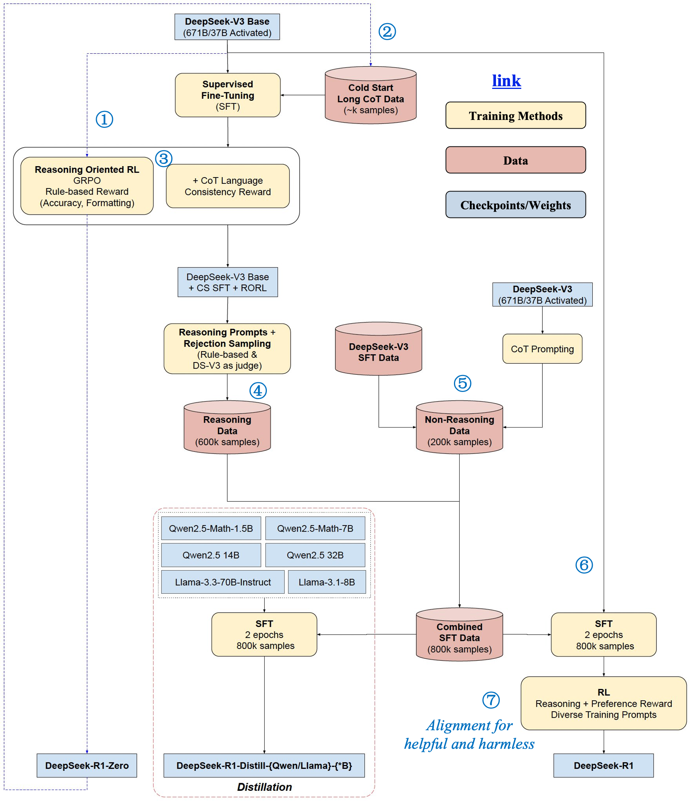

# DeepSeek LLMs
> 此章节记录 DeepSeek 系列大模型相关的面试题目（偏宏观，细节算法详见具体章节）

### Q. DeepSeek-R1 相比其他大模型做了哪些优化？
> **Company**: 美团 | **Round**: 大模型算法工程师 一面 | **Date**: 2025-08-31 | **Tags**: [DeepSeek-R1, LLM, 优化]

**1. 训练范式：融入多阶段训练＋Cold-Start 数据**  
- **R1-Zero**：首次提出基于 **纯强化学习（RL）** 的训练，不依赖监督微调（SFT）阶段，模型自发展现强大的推理能力。  
- **DeepSeek-R1**：在 RL 前加入少量高质量的 “cold-start” 数据进行预热，再结合迭代 RL 和监督微调，显著提升模型输出的可读性和用户友好性。  

**2. 推理链强化与思考时间延展**  
- 模型设计鼓励更长的推理链（Chain-of-Thought），即让模型在回答前“多思考”，提高复杂任务的正确性:contentReference[oaicite:2]{index=2}。  
- 在 RL 框架中，还引入类似于 **GRPO（Group Relative Policy Optimization）** 的方法—在同一 Prompt 下生成多响应，通过组内奖励归一化替代 Critic，既节省计算资源，又降低训练方差。

**3. 成本控制 + 开源透明**  
- **高性价比**：号称训练与推理成本远低于行业标杆模型，比如GPT-4 或 OpenAI-o1；部分报告指出其训练成本仅为 GPT-4 的一小部分，推理开销大幅下降。  
- **完全开源**：采用 MIT 许可证，提供模型代码与权重，支持社区复用与商业化。

**4. 精度与推理能力的显著提升**  
- 在多项推理与数学任务中表现优秀，如 AIME、MATH-500、LiveCodeBench、Codeforces 等，优于众多公开开源模型，并与 OpenAI-o1-1217 不相上。  
- 在多语言、专业领域如复杂眼科医学推理上，也展现出优越水平，超越 Gemini、OpenAI-o1 与 o3-mini 等竞争对手。

**5. 支持蒸馏与量化部署**  
- 提供多个 distilled 版本（如 1.5B, 7B, 8B, 14B, 32B, 70B），使用 Qwen 与 Llama 系列模型架构，可用于边缘部署或推理加速。  
- 针对推理部署场景提供量化工具：4-bit 量化几乎不损失性能，适用于常规 GPU；并提出更高效的 3-bit 量化方案（DQ3_K_M）以支持低资源环境部署。

| 优化方向          | 关键特性与优势                                                     |
|------------------|------------------------------------------------------------------|
| 多阶段训练结构      | Cold-Start + RL + SFT 多环节协同优化模型可读性与推理质量                     |
| 推理链与 RL 架构   | 长链思考与 GRPO 带来更强推理能力与训练效率                               |
| 成本与开源策略      | 低成本、MIT 授权、社区友好，有利于广泛传播与二次开发                          |
| 性能对标强模型      | 在数学、代码、医学推理任务中，达到或超越 o1，开源模型中表现领先                        |
| 部署灵活与精度保留  | 支持蒸馏与轻量化量化部署，适配不同算力与场景，不损伤模型能力                   |

<mark>**总结**：DeepSeek-R1 引入 Cold-Start 加 RL、GRPO 策略、推理链增强等创新机制，实现低成本、高性能的推理模型，兼具开源开放与工业部署友好性，是当前 reasoning-oriented LLM 的典型代表。<mark>

### Q. DeepSeek-R1 是怎么训练得到的，给我一个完整的训练流程？
> **Company**: 美团 | **Round**: 大模型算法工程师 一面 | **Date**: 2025-09-03 | **Tags**: [DeepSeek-R1, LLM, 训练流程]

DeepSeek-R1 在 DeepSeek-V3 基础上，采用 **多阶段训练 + 冷启动数据 + GRPO RL + 合成数据 + 蒸馏** 等策略，逐层优化模型的推理能力、表达质量与部署友好性。其性能达到 OpenAI-o1 水平，且训练成本大幅降低。

**阶段 1: 初始化 & 冷启动 SFT**  
- 基于 **DeepSeek-V3 Base**（已预训练，在数学、编码等任务上性能优异）作为起点。  
- 使用少量高质量的“Cold-Start”数据（包括推理过程 + 总结），通过 **监督微调（SFT）**，提升可读性与格式一致性。

**阶段 2: 无监督 RL 微调（DeepSeek-R1-Zero）**  
- 不依赖任何监督数据，采用 **GRPO（Group Relative Policy Optimization）** 强化学习方法训练模型。  
  - 奖励设计包括 **准确性奖励**（如数学题答案正确）和 **格式奖励**（如正确输出推理 trace）。  
- 生成推理能力显著增强，但可读性与语言一致性欠佳（如中英混杂）。

**阶段 3: 语言一致性 RL + 合成数据生成**
- 用**DeepSeek-V3 Base + Cold-Start SFT + RORL**对“推理类 Prompts”批量采样，并结合 **规则 + DeepSeek-V3 作为裁判**做 **拒绝采样**，筛出高质量、带完整 CoT 的样本。
- **Non-Reasoning 数据（200K）**：由 **DeepSeek-V3（未走 RL）** 通过 **CoT Prompting** 直接生成。

**阶段 4: 合成数据 SFT**  
- 将上述 800K 条数据用于 **SFT DeepSeek-V3 Base**，训练 2 个 epoch，实现质量与推理能力的双提升。

**阶段 5: 最终强化学习微调（DeepSeek-R1）**  
- 基于 SFT 模型，再次应用 **GRPO RL**：  
  - 推理任务使用规则型奖励（accuracy, formatting）；  
  - 非推理任务引入模型型 reward（helpfulness, harmlessness）。  
- 最终产出 **DeepSeek-R1**，性能与 OpenAI-o1 可比。

**阶段 6: 蒸馏与部署优化**  
- 使用 R1 生成的 800K 合成数据对 Qwen / LLaMA 等架构进行 **蒸馏训练**，生成多个规模模型（1.5B/7B/8B/14B/32B/70B）。  
- 这些 distilled 模型支持资源节省、灵活部署，保持推理性能。

| 阶段 | 方法 | 核心目标 |
|------|------|----------|
| 1 | Cold-Start SFT | 提升可读性与一致格式 |
| 2 | GRPO RL (R1-Zero) | 强化推理能力生成“思考流程” |
| 3 | 探入语言一致性 + 数据合成 | 修正模型语言混杂，丰富数据 |
| 4 | 合成数据 SFT | 平衡推理能力与语言流畅性 |
| 5 | GRPO RL with mixed rewards | 继续强化推理，同时兼顾帮助性与无害性 |
| 6 | 蒸馏 | 产出多尺寸模型，适配不同部署需求 |

<mark>**总结**：DeepSeek-R1 的训练是一个由浅入深的多阶段策略：从少量冷启动数据微调，到“无监督自我强化训练”，再结合语言一致性优化与合成大规模数据，最后通过蒸馏实现高性能模型家族。其思维链 自发增强 + 可读性优化 和 强推理能力 的融合，是其对标 OpenAI-o1 的关键所在。<mark>

### Q. 讲讲 DeepSeek 的 MLA(Multi-Head Latent Attention, 多头潜在注意力)？
> **Company**: 快手 ｜ **Round**: 算法工程师 一面 ｜ **Date**: 2025-09-01 ｜ **Tags**: [DeepSeek, MLA]

**1. 什么是 MLA（Multi-Head Latent Attention）？**  
- MLA 是 DeepSeek 在其 V2、V3 和 R1 等多个模型版本中提出的一种创新注意力机制，用于显著压缩 KV cache，从而提升推理效率。  
- 其核心思路是：将高维的 Key/Value 信息映射为低维的“latent”（潜在）向量，缓存时仅存储这部分低维向量，在推理时再通过网络映射回高维，从而实现 KV cache 的大幅压缩。

**2. 主要优势**  
- **极大地压缩 KV cache 大小**，例如论文中提到：DeepSeek-V2 的 KV cache 存储减少了约 90% 以上，且仅带来很小的性能损失（如 LongBench 下降约 0.5%）。  
- DeepSeek-V2 中，还实现了训练成本与推理效率的提升：训练成本降低 ~42.5%，生成吞吐率提升 ~5.76 倍。  
- 在后续版本 R1 中，MLA 进一步在 KV cache 压缩上取得了极致表现（如实现 57 倍压缩），同时推理速度提高超过 6 倍，并保持模型性能。

**3. 背后的机制解析**  
- 输入隐藏状态 \(h_t\) 通过一个线性层映射到一个低维 latent 向量 \(c^K V_t\)，这就是要缓存的内容；在推理时再通过两个线性映射重构回原始维度的 Key/Value：  
  \[
  c^{KV}_t = \text{Linear}_{\text{down}}(h_t);\quad
  K_t = \text{Linear}_{\text{up\,to\,K}}(c^{KV}_t);\quad
  V_t = \text{Linear}_{\text{up\,to\,V}}(c^{KV}_t)
  \]  
  这是一种低秩 joint compression（低秩联合压缩）策略。
- 论文还提出了从传统 MHA 转换到 MLA 的 fine-tuning 方法（MHA2MLA），包括基于 RoPE 的降维优化与对 K/V 参数的联合 SVD 低秩逼近策略，使得几乎无需重新训练就能适配 MLA 架构。

**4. 工程及应用亮点**  
- MLA 是 DeepSeek 大模型系列（V2/V3/R1）的重要推理优化核心，实现了高效长上下文推理与成本节省的“双赢”。  
- 社区生态支持也在快速兴起，例如 vLLM 已集成 MLA 支持与 FP8 优化，进一步推动高效生成模型的落地。

<mark>核心：MLA 是一种通过将高维 KV 缓存压缩成低维 latent 表达并在需要时重构的注意力机制，使得长上下文推理在节省存储和计算的同时，仍能保持模型性能。</mark>

### Q. DeepSeek-R1-Zero 和 R1 的区别  
> **Company**: 科大讯飞 ｜ **Round**: 飞星计划算法工程师 一面 ｜ **Date**: 2025-07-01 ｜ **Tags**: [DeepSeek-R1, DeepSeek-R1-Zero]

**1. 训练流程 & 微调区别**  
- R1-Zero 是在 *没有监督微调 (SFT)* 的情况下，通过纯 **GRPO 强化学习 + 规则型奖励函数** 训练出来的模型。它从基本模型直接进入 RL 阶段，不先用大量标注或格式化的输入输出进行监督调优。
- R1 则在此基础上加了多个阶段：  
  1. 用 “cold-start / SFT” 数据来对模型做初始格式/输出风格的训练，改善可读性和一致性。
  2. 在强化学习阶段，除了规则型 reward，还引入监督式或模型型奖励（例如 “language consistency reward” 或非推理任务上的帮助性/无害性等维度）以更全面对齐人类偏好。 

**2. 输出质量 &行为差异**  
- R1-Zero 表现出较强的推理能力、自检 (self-verification)、长 chain of thought（CoT）等倾向，但缺点包括：格式不够规范、可读性差、经常中英文混合、语言风格不统一。
- R1 则以更稳定、易读且风格一致的输出为优势。它对推理任务优化后在数学、逻辑等任务上比 R1-Zero 有更好的鲁棒性和用户体验。 

**3. 奖励模型与奖励函数**  
- R1-Zero 的奖励主要是规则型 reward（rule-based rewards）：精确性 reward（数学题答案正确／代码执行正确） + 格式 reward（回答格式、思维过程 tag 等）等。没有或很少使用监督（标注偏好）训练的奖励模型。  
- R1 在此之上加入“语言一致性奖励”以及模型型（或基于人类偏好标注的）奖励，用以在非推理任务上提升帮助性、安全性、流畅性等综合表现。

**4. 综合基准表现差异**  
- 在 reasoning 和数学任务上，两者表现差别存在但不大：R1-Zero 在 ARC-AGI-1、AIME 等任务上比基础 V3 模型提升显著，而 R1 在这些任务上通常比 R1-Zero略有优势。
- 对于可读性、一致性、格式规范等指标，R1 明显优于 R1-Zero，因为 R1 训练中考虑了这些因素。 

**5. 应用与选择建议**  
- 如果优先要的是 **原始推理能力、创新性** 并能容忍输出格式上有瑕疵，可以使用 R1-Zero。  
- 如果场景要求 **输出风格一致、阅读友好、适合产品级部署**，R1 是更安全的选择。  

✅ **总结**：R1-Zero 是一个几乎纯 RL + 规则奖励的模型，强调推理与探索性；R1 在此基础上叠加 SFT、标注奖励、风格一致性等，使模型更加成熟，输出更自然、更易用，同时在任务表现上略有提升。  
